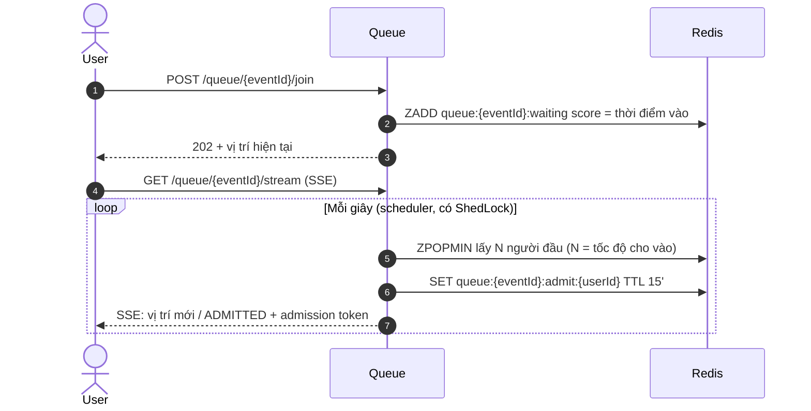
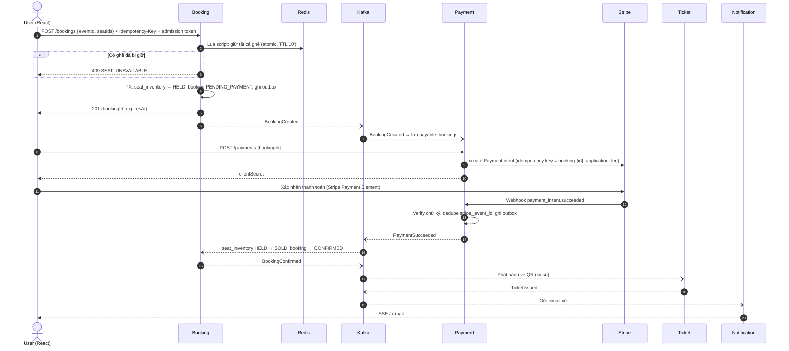

# TicketRush — Tài liệu thiết kế hệ thống

> Nền tảng bán vé sự kiện / concert có flash sale, hỗ trợ marketplace (ban tổ chức bán vé, nền tảng thu phí).
> Mục tiêu học tập: xây dựng **và vận hành** một hệ thống ở mức production — từ code đến scale, giám sát, xử lý sự cố.

| Thông tin | Giá trị |
|---|---|
| Trạng thái | Bản thiết kế — đang review |
| Cập nhật | 02/10/2026 |
| Backend | Java 21 · Spring Boot · REST API |
| Frontend | React · TypeScript · shadcn/ui |
| Ràng buộc | Dự án cá nhân, chi phí ~0$ |

---

## Mục lục

1. [Tổng quan](#1-tổng-quan)
2. [Actors & chức năng](#2-actors--chức-năng)
3. [Quy tắc nghiệp vụ](#3-quy-tắc-nghiệp-vụ)
4. [Kiến trúc tổng thể](#4-kiến-trúc-tổng-thể)
5. [Services & quyền sở hữu dữ liệu](#5-services--quyền-sở-hữu-dữ-liệu)
6. [Mô hình dữ liệu](#6-mô-hình-dữ-liệu)
7. [Luồng nghiệp vụ chính](#7-luồng-nghiệp-vụ-chính)
8. [Thiết kế Event (Kafka)](#8-thiết-kế-event-kafka)
9. [Thiết kế Redis](#9-thiết-kế-redis)
10. [Chống oversell (Concurrency)](#10-chống-oversell-concurrency)
11. [Thiết kế API](#11-thiết-kế-api)
12. [Realtime (SSE)](#12-realtime-sse)
13. [Bảo mật](#13-bảo-mật)
14. [Frontend](#14-frontend)
15. [Resilience](#15-resilience)
16. [Observability](#16-observability)
17. [Scaling](#17-scaling)
18. [Dữ liệu: HA, backup & khôi phục](#18-dữ-liệu-ha-backup--khôi-phục)
19. [Triển khai & môi trường](#19-triển-khai--môi-trường)
20. [Kiểm thử](#20-kiểm-thử)
21. [Tech stack](#21-tech-stack)
22. [Cấu trúc repository](#22-cấu-trúc-repository)
23. [AWS & kiểm soát chi phí](#23-aws--kiểm-soát-chi-phí)
24. [Quyết định kiến trúc (ADR)](#24-quyết-định-kiến-trúc-adr)
25. [Câu hỏi mở](#25-câu-hỏi-mở)

---

## 1. Tổng quan

### 1.1. Bài toán

Bán vé concert là bài toán có tải **cực kỳ không đều**: ngày thường gần như không có traffic, nhưng khi mở bán một concert hot, hàng nghìn người cùng tranh vài trăm ghế trong vài giây. Hệ thống phải:

- **Không bao giờ bán 1 ghế cho 2 người** (oversell) — đây là bất biến số 1.
- **Không mất tiền / không mất đơn**: đã trừ tiền thì phải có vé, hoặc được hoàn tiền tự động.
- **Chịu được đột biến tải** bằng hàng đợi ảo + auto-scaling, và **co lại** khi rảnh để tiết kiệm chi phí.
- **Chết từng phần chứ không chết toàn bộ** khi một thành phần (DB, Redis, Stripe…) gặp sự cố.

### 1.2. Phạm vi

| Trong phạm vi | Ngoài phạm vi |
|---|---|
| Sự kiện có ghế ngồi theo sơ đồ (seated) | Vé đứng không đánh số (general admission) — có thể bổ sung sau |
| Phòng chờ ảo khi flash sale | Mobile app native (dùng web responsive + PWA) |
| Thanh toán thẻ qua Stripe (test mode) | Ví điện tử VN (MoMo, VNPay…) |
| Marketplace: ban tổ chức nhận tiền qua Stripe Connect | Chuyển nhượng / bán lại vé |
| Vé điện tử QR có chữ ký số, check-in tại cổng | Tích hợp phần cứng cổng soát vé |
| Hoàn vé theo chính sách | Xử lý tranh chấp (dispute) tự động |

---

## 2. Actors & chức năng

| Actor | Chức năng |
|---|---|
| **Guest** | Xem / tìm kiếm sự kiện, xem sơ đồ ghế |
| **Customer** | Vào phòng chờ, chọn ghế, thanh toán, nhận vé QR (email + trong app), xem lịch sử đơn, yêu cầu hoàn vé |
| **Organizer** | Đăng ký làm ban tổ chức, kết nối Stripe (nhận tiền), tạo sự kiện, gán hạng vé cho khu ghế, cấu hình giờ mở bán, xem doanh thu realtime, quét vé check-in |
| **Admin** | Duyệt organizer, quản lý địa điểm & sơ đồ ghế, cấu hình phí nền tảng, xem audit log, hoàn tiền thủ công, bật/tắt feature flag |
| **Hệ thống** | Hết hạn giữ ghế, đối soát thanh toán với Stripe, gửi thông báo |

---

## 3. Quy tắc nghiệp vụ

| Mã | Quy tắc |
|---|---|
| BR-01 | Một ghế của một sự kiện chỉ được bán cho **đúng 1** booking ở trạng thái CONFIRMED |
| BR-02 | Mỗi booking tối đa **6 ghế**; mỗi user tối đa **1 booking đang chờ thanh toán** cho mỗi sự kiện |
| BR-03 | Ghế được **giữ 10 phút** kể từ khi tạo booking; quá hạn chưa thanh toán → tự động nhả ghế |
| BR-04 | Phòng chờ chỉ bật cho sự kiện được đánh dấu `high_demand` (hoặc qua feature flag); user được vào chọn ghế có **admission token hạn 15 phút** |
| BR-05 | Organizer chỉ được publish sự kiện khi đã được Admin duyệt **và** tài khoản Stripe Connect đã `charges_enabled` |
| BR-06 | Phí nền tảng mặc định **5%** giá vé (application fee), cấu hình được bởi Admin |
| BR-07 | Hoàn vé được phép đến **48 giờ trước giờ diễn**; hoàn 100% giá vé, phí nền tảng không hoàn |
| BR-08 | Sự kiện bị huỷ → hoàn tiền toàn bộ booking tự động |
| BR-09 | Một vé chỉ được check-in **1 lần**; vé đã hoàn bị thu hồi (REVOKED) |
| BR-10 | Tiền lưu dạng **số nguyên đơn vị nhỏ nhất** (`amount_minor` BIGINT) + mã tiền tệ (mặc định **VND**, zero-decimal — xem Q1); không dùng float/double |
| BR-11 | Thời gian lưu **UTC** (`timestamptz`), hiển thị theo `Asia/Ho_Chi_Minh` |

---

## 4. Kiến trúc tổng thể

### 4.1. Sơ đồ

```
                         ┌───────────────────────────────┐
  Browser                │  React SPA (shadcn)           │
  ───────────────────────│  Host: nginx / S3+CloudFront  │
                         └───────────────┬───────────────┘
                                         │ HTTPS, session cookie (HttpOnly)
                                         │ cùng domain: /  → SPA, /api → Gateway
                         ┌───────────────▼───────────────┐        ┌────────────┐
                         │  Gateway / BFF                │◀──────▶│  Keycloak  │
                         │  Spring Cloud Gateway         │  OIDC  │  (IdP)     │
                         │  • login, giữ token           │        └────────────┘
                         │  • token relay, rate limit    │
                         │  • session trong Redis        │
                         └───────────────┬───────────────┘
                                         │ REST + JWT
     ┌──────────────┬──────────────┬─────┴────────┬──────────────┬────────────────┐
     ▼              ▼              ▼              ▼              ▼                ▼
┌─────────┐   ┌──────────┐   ┌──────────┐   ┌──────────┐   ┌──────────┐   ┌──────────────┐
│ Catalog │   │  Queue   │   │ Booking  │   │ Payment  │   │  Ticket  │   │ Notification │
└────┬────┘   └────┬─────┘   └────┬─────┘   └────┬─────┘   └────┬─────┘   └──────┬───────┘
     │             │              │              │  ▲           │                │
     │             │              │              │  │ webhook   │                │
     │             │              │              ▼  │           │                │
     │             │              │          ┌────────┐         │                │
     │             │              │          │ Stripe │         │                │
     │             │              │          └────────┘         │                │
═════╧═════════════╧══════════════╧══════════════╧══════════════╧════════════════╧═════
                     Kafka (KRaft) + Schema Registry + Debezium (outbox CDC)
═════════════════════════════════════════════════════════════════════════════════════

 Lưu trữ:  PostgreSQL (mỗi service 1 database)  ·  Redis  ·  Elasticsearch  ·  MinIO / S3
 Nền tảng: Vault · Unleash · Prometheus/Grafana · ELK · Jaeger
```

### 4.2. Nguyên tắc thiết kế

| # | Nguyên tắc | Ý nghĩa |
|---|---|---|
| P1 | **Database per service** | Không service nào truy cập DB của service khác. Cần dữ liệu của nhau → nhận qua event và lưu bản sao (projection) |
| P2 | **Async-first** | Gọi đồng bộ (REST) chỉ khi user đang chờ kết quả. Còn lại giao tiếp qua Kafka |
| P3 | **Outbox pattern** | Ghi dữ liệu nghiệp vụ và event trong **cùng 1 transaction** → không bao giờ "lưu DB xong mà quên gửi event" |
| P4 | **Idempotent everywhere** | Mọi consumer, mọi API tạo mới, mọi lệnh gọi Stripe đều chịu được việc bị gọi lặp |
| P5 | **Stateless services** | Không giữ state trong RAM của pod (session ở Redis) → scale-out/in tự do |
| P6 | **Fail-closed cho tồn kho** | Khi không chắc chắn ghế còn trống → từ chối bán, thà mất 1 đơn còn hơn oversell |
| P7 | **Modular monolith trước, tách sau** | Giai đoạn đầu các service là **module** trong 1 ứng dụng (Spring Modulith); ranh giới module trùng với ranh giới service nên tách ra không phải đập đi làm lại |
| P8 | **Observable by default** | Mọi request có `traceId` xuyên suốt log, metric, trace |

### 4.3. Hình thái triển khai

```
Giai đoạn 1 — Modular monolith          Giai đoạn 2 — Microservices
┌──────────────────────────────┐         ┌─────────┐ ┌─────────┐ ┌─────────┐
│ ticketrush-app               │         │ catalog │ │ booking │ │ payment │ ...
│  ├─ catalog   (module)       │  ───▶   └─────────┘ └─────────┘ └─────────┘
│  ├─ booking   (module)       │         mỗi service 1 deployable, 1 database
│  ├─ payment   (module)       │
│  └─ ...                      │
│ event nội bộ: Spring Modulith│
│ 1 Postgres, mỗi module 1 schema
└──────────────────────────────┘
```

---

## 5. Services & quyền sở hữu dữ liệu

| Service | Trách nhiệm | Sở hữu dữ liệu | Lưu trữ |
|---|---|---|---|
| **Gateway (BFF)** | Đăng nhập OIDC, giữ token, định tuyến, rate limit | Session | Redis |
| **Catalog** | Organizer profile, địa điểm, sơ đồ ghế, sự kiện, hạng vé, tìm kiếm | organizers, venues, seat_maps, seats, events, ticket_tiers | Postgres, Elasticsearch (projection), S3 (ảnh) |
| **Queue** | Phòng chờ ảo, cấp admission token | Hàng đợi, lượt được vào | Redis |
| **Booking** | Tồn kho ghế theo sự kiện, giữ ghế, vòng đời booking | seat_inventory, bookings, booking_items | Postgres, Redis (giữ ghế) |
| **Payment** | Stripe PaymentIntent, webhook, Connect, hoàn tiền, đối soát | payments, refunds, stripe_events, connected_accounts | Postgres |
| **Ticket** | Phát hành vé QR, check-in, thu hồi vé | tickets, check_ins, signing_keys | Postgres |
| **Notification** | Gửi email, đẩy realtime | notification_log, templates | Postgres |

---

## 6. Mô hình dữ liệu

> Quy ước chung: khoá chính `UUIDv7` (sắp xếp theo thời gian, thân thiện index); mọi bảng có `created_at`, `updated_at`; bảng có cập nhật đồng thời có cột `version` (optimistic locking).

### 6.1. Catalog

```
organizers      (id = keycloak user id, display_name, status[PENDING|APPROVED|SUSPENDED], approved_at)
administrative_units (id, code UNIQUE, name, type[TINH|THANH_PHO|PHUONG|XA|DAC_KHU],
                 level SMALLINT[1|2], parent_id NULL → administrative_units, is_active,
                 effective_from, version)               -- 1 bảng cho cả 2 cấp
venues          (id, name, address, ward_id → administrative_units, capacity)
seat_maps       (id, venue_id, name, width, height)
sections        (id, seat_map_id, code, name, shape_json)
seats           (id, section_id, row_label, seat_number, x, y)
events          (id, organizer_id, venue_id, seat_map_id, title, description, category,
                 banner_url, starts_at, ends_at, sale_starts_at,
                 status[DRAFT|PUBLISHED|ON_SALE|SOLD_OUT|ENDED|CANCELLED],
                 high_demand BOOLEAN, version)
ticket_tiers    (id, event_id, name, price_minor, currency)
tier_sections   (tier_id, section_id)            -- hạng vé áp dụng cho khu ghế nào
```

**Đơn vị hành chính** dùng mô hình 2 cấp áp dụng từ 01/07/2025: cấp 1 là Tỉnh/Thành phố (34 đơn vị), cấp 2 là Xã/Phường/Đặc khu.

```sql
CHECK ((level = 1 AND parent_id IS NULL) OR (level = 2 AND parent_id IS NOT NULL));
CREATE INDEX ix_admin_units_parent ON administrative_units (parent_id) WHERE is_active;
```

- Địa điểm chỉ tham chiếu cấp xã (`venues.ward_id`); tỉnh/thành lấy qua `parent_id`. Bản ghi Elasticsearch của sự kiện lưu sẵn tên tỉnh để lọc "Thành phố" mà không phải join.
- Không xoá cứng đơn vị đang có đơn vị con hoặc địa điểm tham chiếu. Khi đó chỉ chuyển `is_active = false` để ẩn khỏi danh sách chọn, còn dữ liệu cũ giữ nguyên.
- Khởi tạo dữ liệu bằng import Excel theo danh mục mã chính thức. Lần sau cập nhật cũng qua import, khớp theo `code`.

### 6.2. Booking

```
seat_inventory  (event_id, seat_id, tier_id, price_minor, currency,
                 status[AVAILABLE|HELD|SOLD], booking_id NULL, version,
                 PRIMARY KEY (event_id, seat_id))
bookings        (id, user_id, event_id,
                 status[PENDING_PAYMENT|CONFIRMED|EXPIRED|CANCELLED|REFUND_REQUESTED|REFUNDED],
                 total_minor, currency, expires_at, idempotency_key UNIQUE, version)
booking_items   (booking_id, seat_id, tier_id, price_minor)
outbox          (id, aggregate_type, aggregate_id, event_type, payload, created_at)
processed_events(event_id PRIMARY KEY, processed_at)        -- idempotent consumer
```

Ràng buộc chống oversell ở tầng DB:

```sql
-- Mỗi user chỉ 1 booking đang chờ thanh toán cho mỗi sự kiện
CREATE UNIQUE INDEX uq_one_pending_per_user
  ON bookings (user_id, event_id) WHERE status = 'PENDING_PAYMENT';
```

### 6.3. Payment

```
connected_accounts (organizer_id PK, stripe_account_id, charges_enabled, payouts_enabled)
payable_bookings   (booking_id PK, user_id, organizer_id, amount_minor, currency, expires_at) -- projection từ BookingCreated
payments           (id, booking_id UNIQUE, stripe_payment_intent_id UNIQUE,
                    amount_minor, application_fee_minor, currency,
                    status[REQUIRES_PAYMENT|PROCESSING|SUCCEEDED|FAILED|CANCELED])
refunds            (id, payment_id, stripe_refund_id UNIQUE, amount_minor, reason, status)
stripe_events      (stripe_event_id PK, type, payload, received_at, processed_at)  -- chống xử lý trùng webhook
outbox, processed_events
```

### 6.4. Ticket

```
tickets        (id, booking_id, event_id, seat_id, owner_user_id,
                status[VALID|USED|REVOKED], qr_token, key_id, issued_at,
                UNIQUE (event_id, seat_id) WHERE status <> 'REVOKED')   -- chốt chặn oversell cuối cùng
check_ins      (id, ticket_id UNIQUE, gate, scanned_by, scanned_at)
signing_keys   (key_id, public_key, status[ACTIVE|RETIRED], created_at)  -- private key nằm trong Vault
```

### 6.5. Notification

```
templates          (code, channel, subject, body_template)
notification_log   (id, user_id, channel[EMAIL|PUSH], template_code, status, sent_at, error)
```

---

## 7. Luồng nghiệp vụ chính

### 7.1. Phòng chờ ảo (Waiting room)



- Tốc độ cho vào (N/giây) cấu hình được, và bị giới hạn thêm bởi **semaphore** số người đang ở bước thanh toán.
- Admission token là JWT ngắn hạn, Booking kiểm tra token trước khi cho giữ ghế.

### 7.2. Đặt vé & thanh toán (Saga)



### 7.3. Các nhánh bù trừ (compensation)

| Tình huống | Xử lý |
|---|---|
| **Hết 10 phút chưa thanh toán** | Job `ExpireBookings` (chạy mỗi 30s, có ShedLock) chuyển booking → EXPIRED, nhả ghế về AVAILABLE, phát `BookingExpired` → Payment huỷ PaymentIntent |
| **Thanh toán thất bại** | Stripe webhook `payment_intent.payment_failed` → `PaymentFailed` → user được thử lại thẻ khác trong thời hạn giữ ghế |
| **Thanh toán thành công nhưng booking đã hết hạn** (race) | Booking thử giữ lại đúng các ghế đó: còn trống → CONFIRMED như bình thường; đã bị người khác mua → phát `BookingConfirmationFailed` → Payment **tự động hoàn tiền** |
| **Webhook đến trễ / không đến** | Job đối soát (reconciliation) quét các payment PROCESSING quá 15 phút, hỏi trạng thái trực tiếp từ Stripe API |
| **Webhook đến sai thứ tự** | Chỉ cho phép chuyển trạng thái tiến (state machine), event cũ hơn trạng thái hiện tại bị bỏ qua |

### 7.4. Hoàn vé

```
Customer yêu cầu hoàn  → Booking kiểm tra BR-07 → REFUND_REQUESTED → RefundRequested
Payment nhận           → gọi Stripe Refund (idempotency key = refund-{bookingId})
Stripe webhook         → charge.refunded → RefundCompleted
Booking nhận           → REFUNDED, ghế về AVAILABLE
Ticket nhận            → vé REVOKED
Notification nhận      → email xác nhận hoàn tiền
```

### 7.5. Check-in

1. QR trên vé chứa một **JWT ký bằng ECDSA (ES256)**: `{ticketId, eventId, seat, kid}`.
2. App check-in (PWA, camera) **xác minh chữ ký offline** bằng public key → phát hiện vé giả ngay cả khi mất mạng.
3. Gọi `POST /checkins` → cập nhật atomic `UPDATE tickets SET status='USED' WHERE id=? AND status='VALID'` → 0 dòng bị ảnh hưởng nghĩa là vé đã dùng / bị thu hồi.
4. Hỗ trợ **xoay vòng khoá** (key rotation) qua `kid`.

### 7.6. Onboarding Organizer

```
User đăng ký organizer → Catalog: organizers PENDING
Admin duyệt            → APPROVED, Keycloak gán role ORGANIZER
Organizer kết nối Stripe → Payment tạo Stripe Connect (Express) account + onboarding link
Stripe webhook account.updated → connected_accounts.charges_enabled = true → OrganizerPayoutReady
Catalog nhận           → cho phép publish sự kiện (BR-05)
```

---

## 8. Thiết kế Event (Kafka)

### 8.1. Topics

| Topic | Key | Events | Producer | Consumers |
|---|---|---|---|---|
| `catalog.events.v1` | eventId | EventPublished, EventUpdated, EventCancelled, OrganizerPayoutReady | Catalog | Booking, Search projection, Notification |
| `booking.events.v1` | bookingId | BookingCreated, BookingConfirmed, BookingExpired, BookingConfirmationFailed, RefundRequested | Booking | Payment, Ticket, Notification |
| `payment.events.v1` | bookingId | PaymentSucceeded, PaymentFailed, RefundCompleted, OrganizerPayoutReady | Payment | Booking, Ticket, Notification, Catalog |
| `ticket.events.v1` | ticketId | TicketIssued, TicketCheckedIn, TicketRevoked | Ticket | Notification, Analytics |

- **Key** quyết định partition → mọi event của cùng 1 booking đi vào cùng partition → **đảm bảo thứ tự**.
- Mặc định 6 partitions / topic (giới hạn số consumer chạy song song tối đa là 6 mỗi group — cần nhớ khi thiết kế scaling).
- Retry topic: `<topic>.retry-*`; message lỗi sau khi retry hết → `<topic>.dlt` (Dead Letter Topic), có alert.

### 8.2. Event envelope

```json
{
  "eventId": "0192f...",          // UUIDv7, dùng để dedupe
  "eventType": "PaymentSucceeded",
  "schemaVersion": 1,
  "aggregateId": "booking-id",
  "occurredAt": "2026-10-02T13:00:00Z",
  "traceId": "4bf92f3577b34da6...", // nối trace xuyên Kafka
  "payload": { ... }
}
```

- Định dạng **Avro**, schema lưu trong `backend/contracts`, đăng ký ở **Schema Registry** với chế độ tương thích `BACKWARD`.

### 8.3. Đảm bảo giao nhận

| Vấn đề | Giải pháp |
|---|---|
| Lưu DB xong nhưng gửi event thất bại | **Transactional Outbox** → Debezium đọc WAL của Postgres, đẩy sang Kafka (giai đoạn monolith: Spring Modulith event externalization) |
| Event bị giao nhiều lần (at-least-once) | **Idempotent consumer**: bảng `processed_events`, insert eventId trong cùng transaction với xử lý nghiệp vụ |
| Mất message khi broker chết | `acks=all`, `replication.factor=3`, `min.insync.replicas=2` (trên K8s) |
| Consumer lỗi liên tục với 1 message (poison pill) | Retry có backoff → DLT → alert → xử lý tay, replay lại |

---

## 9. Thiết kế Redis

> Dùng **hash tag** `{eventId}` trong key để mọi key của cùng 1 sự kiện nằm cùng 1 slot khi chạy Redis Cluster (Lua script chỉ chạy được trên key cùng slot).

| Key | Kiểu | TTL | Mục đích |
|---|---|---|---|
| `queue:{eventId}:waiting` | ZSET (userId → timestamp) | — | Hàng chờ, `ZRANK` = vị trí |
| `queue:{eventId}:admit:{userId}` | STRING | 15 phút | User đã được vào |
| `seat:{eventId}:{seatId}` | STRING (bookingId) | 10 phút | Ghế đang được giữ |
| `seatstatus:{eventId}` | HASH (seatId → status) | — | Trạng thái ghế để render sơ đồ nhanh |
| `sem:checkout:{eventId}` | Redisson Semaphore | — | Giới hạn số người cùng ở bước thanh toán |
| `lock:seatmap:{eventId}` | Redisson Lock | tự gia hạn | Chặn sửa sơ đồ đồng thời |
| `rl:{userId}` / `rl:ip:{ip}` | Bucket4j | — | Rate limit |
| `cache:event:{eventId}` | STRING (JSON) | 5 phút + jitter | Cache chi tiết sự kiện |
| `spring:session:*` | HASH | 30 phút | Session của Gateway |
| channel `seat-updates:{eventId}` | Pub/Sub | — | Broadcast trạng thái ghế tới mọi pod đang giữ kết nối SSE |

**Chống cache stampede**: TTL có jitter ngẫu nhiên + chỉ 1 request được rebuild cache (lock), các request khác trả dữ liệu cũ.

---

## 10. Chống oversell (Concurrency)

Phòng thủ theo **3 lớp** (defense in depth) — lớp sau bắt lỗi của lớp trước:

```
Lớp 1 — Redis (nhanh, chặn 99.9% tranh chấp)
  Lua script atomic: kiểm tra TẤT CẢ ghế trống → SET tất cả với TTL. Có 1 ghế bận → không giữ ghế nào.

Lớp 2 — Postgres (nguồn sự thật)
  UPDATE seat_inventory SET status='HELD', booking_id=?, version=version+1
  WHERE event_id=? AND seat_id IN (...) AND status='AVAILABLE'
  → số dòng cập nhật ≠ số ghế yêu cầu → rollback toàn bộ.

Lớp 3 — Ràng buộc DB (chốt chặn cuối)
  UNIQUE (event_id, seat_id) trên tickets cho vé chưa bị thu hồi.
```

Lua script giữ ghế (minh hoạ):

```lua
-- KEYS = danh sách seat:{eventId}:{seatId}, ARGV[1] = bookingId, ARGV[2] = ttl ms
for i, key in ipairs(KEYS) do
  if redis.call('EXISTS', key) == 1 then return 0 end
end
for i, key in ipairs(KEYS) do
  redis.call('SET', key, ARGV[1], 'PX', ARGV[2])
end
return 1
```

**Khi Redis chết**: theo nguyên tắc P6 (fail-closed) — tạm dừng giữ ghế mới, trả thông báo "đang bảo trì bán vé"; xem sự kiện vẫn hoạt động bình thường.

**Bất biến được kiểm chứng** bằng load test (JMeter) và truy vấn đối soát:

```sql
-- Phải luôn trả về 0 dòng
SELECT event_id, seat_id, COUNT(*) FROM tickets
WHERE status <> 'REVOKED' GROUP BY event_id, seat_id HAVING COUNT(*) > 1;
```

---

## 11. Thiết kế API

### 11.1. Quy ước

| Hạng mục | Quy ước |
|---|---|
| Kiểu | REST/JSON, tiền tố `/api/v1` |
| Contract | OpenAPI 3 sinh tự động (springdoc) → FE sinh client bằng Orval |
| Lỗi | **RFC 9457 Problem Details** (`application/problem+json`) kèm `code` nghiệp vụ, ví dụ `SEAT_UNAVAILABLE` |
| Phân trang | `?page=&size=` cho danh sách quản trị; cursor cho danh sách dài |
| Idempotency | Header `Idempotency-Key` bắt buộc với `POST /bookings`, `POST /payments`, `POST /refunds` |
| Đặt tên | Danh từ số nhiều, kebab-case: `/ticket-tiers` |
| Thời gian | ISO-8601 UTC |

### 11.2. Endpoint chính

| Method | Path | Role | Mô tả |
|---|---|---|---|
| GET | `/api/v1/events` | public | Tìm kiếm / lọc sự kiện (Elasticsearch) |
| GET | `/api/v1/events/{id}` | public | Chi tiết sự kiện |
| GET | `/api/v1/events/{id}/seats` | public | Sơ đồ ghế + trạng thái |
| GET | `/api/v1/events/{id}/seats/stream` | public | SSE cập nhật trạng thái ghế |
| POST | `/api/v1/queue/{eventId}/join` | customer | Vào phòng chờ |
| GET | `/api/v1/queue/{eventId}/stream` | customer | SSE vị trí trong hàng chờ |
| POST | `/api/v1/bookings` | customer | Giữ ghế, tạo booking |
| GET | `/api/v1/bookings/{id}` | owner | Trạng thái booking |
| POST | `/api/v1/bookings/{id}/refund` | owner | Yêu cầu hoàn vé |
| POST | `/api/v1/payments` | owner | Tạo PaymentIntent, trả `clientSecret` |
| POST | `/api/v1/webhooks/stripe` | Stripe (verify chữ ký) | Nhận webhook |
| GET | `/api/v1/me/tickets` | customer | Vé của tôi |
| POST | `/api/v1/organizer/apply` | customer | Đăng ký làm organizer |
| POST | `/api/v1/organizer/stripe/onboarding-link` | organizer | Link kết nối Stripe |
| POST/PUT | `/api/v1/organizer/events` | organizer | Tạo / sửa sự kiện |
| POST | `/api/v1/organizer/events/{id}/publish` | organizer (owner) | Publish |
| GET | `/api/v1/organizer/events/{id}/sales` | organizer (owner) | Doanh thu (jOOQ) |
| POST | `/api/v1/checkins` | organizer (owner) | Check-in vé |
| POST | `/api/v1/admin/organizers/{id}/approve` | admin | Duyệt organizer |
| CRUD | `/api/v1/admin/venues`, `/admin/seat-maps` | admin | Quản lý địa điểm, sơ đồ ghế |
| GET | `/api/v1/administrative-units?level=&parentId=&q=` | public | Danh mục tỉnh/xã (cache, dùng cho dropdown) |
| CRUD | `/api/v1/admin/administrative-units` | admin | Quản lý đơn vị hành chính |
| GET | `/api/v1/admin/imports/templates/{type}` | admin | Tải file mẫu `.xlsx` (`type`: `administrative-units`, `venues`, `seat-maps`) |
| POST | `/api/v1/admin/imports/{type}?dryRun=true` | admin | Kiểm tra file: trả tổng / hợp lệ / lỗi theo dòng–cột; `dryRun=false` để ghi |
| GET | `/api/v1/admin/imports/{id}/errors` | admin | Tải file lỗi `.xlsx` |
| GET | `/api/v1/admin/audit-logs` | admin | Audit log |

---

## 12. Realtime (SSE)

- Dùng **Server-Sent Events** (`SseEmitter`) vì dữ liệu realtime chỉ đi một chiều server → client; hành động của user đi qua REST.
- Chạy trên **virtual threads** → giữ hàng nghìn kết nối SSE không tốn platform thread.
- **Fan-out đa pod**: thay đổi trạng thái ghế ở pod bất kỳ → publish lên Redis channel `seat-updates:{eventId}` → mọi pod nhận và đẩy xuống các client đang kết nối với pod đó → không cần sticky session.
- Heartbeat 15s để giữ kết nối qua proxy / load balancer; client tự reconnect với `Last-Event-ID`.

---

## 13. Bảo mật

### 13.1. Xác thực (BFF pattern)

```
Browser ──cookie SESSION (HttpOnly, Secure, SameSite=Lax)──▶ Gateway ──Bearer JWT──▶ Services
                                                              │
                                                              └─ OIDC Authorization Code + PKCE ─▶ Keycloak
```

- SPA **không bao giờ cầm access token** → chống bị đánh cắp token qua XSS.
- Gateway giữ token trong session (Spring Session + Redis), tự refresh token, chuyển tiếp bằng **TokenRelay**.
- Chống CSRF: Spring Security CSRF token (cookie `XSRF-TOKEN` → header `X-XSRF-TOKEN`).
- FE và API **cùng domain** (`/` và `/api`) → không cần CORS.

### 13.2. Keycloak

| Thành phần | Cấu hình |
|---|---|
| Realm | `ticketrush` |
| Client `ticketrush-bff` | Confidential, Authorization Code + PKCE |
| Client `ticketrush-internal` | Client Credentials cho service gọi service |
| Realm roles | `CUSTOMER` (mặc định), `ORGANIZER`, `ADMIN` |
| Token | Access token 5 phút, refresh token 30 phút |

### 13.3. Phân quyền

- Mỗi service là **OAuth2 Resource Server**: kiểm tra chữ ký JWT, `iss`, `aud`, hạn.
- RBAC bằng `@PreAuthorize("hasRole('ORGANIZER')")`.
- **Kiểm tra quyền sở hữu** (chống IDOR): organizer chỉ thao tác trên sự kiện của mình, customer chỉ xem booking của mình — kiểm tra ở tầng service, không tin ID từ client.

### 13.4. Các biện pháp khác

| Hạng mục | Biện pháp |
|---|---|
| Vé giả | QR là JWT ký ES256, private key trong Vault, xoay vòng theo `kid` |
| Webhook giả mạo | Verify `Stripe-Signature` bằng endpoint secret, từ chối nếu lệch thời gian > 5 phút |
| Bot / spam | Rate limit theo user và IP ở Gateway; admission token bắt buộc khi bật phòng chờ |
| Secrets | Vault (Spring Cloud Vault) / External Secrets trên K8s; không có secret trong Git (gitleaks pre-commit) |
| Input | Bean Validation ở mọi DTO, query tham số hoá (JPA/jOOQ), không nối chuỗi SQL |
| Audit | Ghi lại mọi thao tác quản trị (duyệt organizer, hoàn tiền, đổi phí) — ai, lúc nào, thay đổi gì (Hibernate Envers + bảng audit) |
| Dependency | Trivy + OWASP Dependency-Check trong CI, Renovate tự cập nhật |
| Mạng (K8s) | NetworkPolicy: chỉ Gateway nhận traffic từ ngoài; DB chỉ nhận kết nối từ service sở hữu |
| Headers | CSP, HSTS, X-Content-Type-Options, Referrer-Policy |

---

## 14. Frontend

### 14.1. Kiến trúc

- **SPA** (Vite + React 19 + TypeScript strict), không SSR.
- Gọi API qua client **sinh tự động từ OpenAPI** (Orval → TanStack Query hooks + Zod schema) → BE đổi API, FE báo lỗi lúc compile.
- **Server state** (dữ liệu từ API) → TanStack Query. **Client state** (ghế đang chọn, UI) → Zustand. Không dùng Redux.
- Xác thực: không xử lý token; gọi `GET /api/v1/me` để biết đã đăng nhập chưa và có role gì; login/logout bằng redirect tới Gateway.

### 14.2. Routes

| Khu vực | Routes |
|---|---|
| Public | `/`, `/events`, `/events/:id` |
| Customer | `/events/:id/queue`, `/events/:id/seats`, `/checkout/:bookingId`, `/me/tickets`, `/me/bookings` |
| Organizer | `/organizer/apply`, `/organizer/events`, `/organizer/events/new`, `/organizer/events/:id/edit`, `/organizer/events/:id/dashboard` |
| Check-in (PWA) | `/checkin/:eventId` |
| Admin | `/admin/organizers`, `/admin/venues`, `/admin/seat-maps/:id/editor`, `/admin/administrative-units`, `/admin/audit-logs` |

Bảo vệ route theo role bằng `beforeLoad` của TanStack Router.

### 14.3. Cấu trúc thư mục (feature-based)

```
frontend/src/
├── app/                 # providers, router, query client
├── routes/              # định nghĩa route (TanStack Router file-based)
├── features/
│   ├── events/          # danh sách, chi tiết, tìm kiếm
│   ├── queue/           # phòng chờ + hook SSE
│   ├── seat-map/        # react-konva: render + chọn ghế (customer), editor (admin)
│   ├── checkout/        # Stripe Payment Element, đếm ngược giữ ghế
│   ├── tickets/         # vé của tôi, hiển thị QR
│   ├── organizer/       # quản lý sự kiện, dashboard doanh thu
│   ├── checkin/         # quét QR bằng camera
│   └── admin/
├── components/ui/       # shadcn components
├── api/generated/       # code sinh bởi Orval (không sửa tay)
├── lib/                 # tiện ích chung (sse, format tiền, date)
└── i18n/                # vi, en
```

### 14.4. Thành phần đặc biệt

| Thành phần | Thiết kế |
|---|---|
| **Sơ đồ ghế** | `react-konva` (canvas) — render hàng nghìn ghế mượt; zoom/pan; màu theo hạng vé & trạng thái; cập nhật realtime qua SSE |
| **Checkout** | Stripe Payment Element; đồng hồ đếm ngược theo `expiresAt`; hết giờ → quay về chọn ghế |
| **Phòng chờ** | Hiển thị vị trí + thời gian chờ ước tính, tự chuyển trang khi ADMITTED |
| **Check-in** | Quét QR bằng camera, verify chữ ký offline, phản hồi màu xanh/đỏ + âm thanh |
| **Dashboard** | Recharts: doanh thu theo thời gian, tỷ lệ lấp đầy theo hạng vé |

---

## 15. Resilience

### 15.1. Cấu hình Resilience4j khi gọi Stripe

| Cơ chế | Cấu hình |
|---|---|
| Timeout | 3 giây |
| Retry | 3 lần, exponential backoff 200ms × 2 + jitter; **chỉ retry khi có idempotency key** |
| Circuit Breaker | Mở khi ≥ 50% lỗi trong 20 lần gọi gần nhất; mở 30s; half-open thử 5 request |
| Bulkhead | Tối đa 20 lời gọi Stripe đồng thời mỗi pod |

### 15.2. Ma trận suy giảm (khi một thành phần chết)

| Thành phần chết | Ảnh hưởng | Hệ thống phản ứng |
|---|---|---|
| **Elasticsearch** | Không tìm kiếm full-text | Fallback sang truy vấn Postgres đơn giản (lọc theo ngày, thành phố); đặt vé không ảnh hưởng |
| **Redis** | Không giữ ghế, không phòng chờ, mất session | Fail-closed: tạm dừng bán vé, hiển thị trang bảo trì; xem sự kiện vẫn chạy |
| **Kafka** | Event không được giao | Outbox tích luỹ trong DB, không mất gì; vé & email đến trễ, tự bắt kịp khi Kafka sống lại |
| **Stripe** | Không thanh toán được | Circuit breaker mở, báo lỗi ngay; ghế vẫn được giữ đến hết hạn |
| **Notification** | Không gửi email | Event nằm trong Kafka, gửi bù khi sống lại; vé vẫn xem được trong app |
| **Keycloak** | Không đăng nhập mới | Session hiện có vẫn hoạt động đến khi hết hạn |
| **Postgres primary** | Không ghi được | Tự failover sang replica (~30s); app retry kết nối |
| **1 pod service** | Giảm năng lực | K8s tự khởi động lại, load balancer bỏ pod lỗi nhờ readiness probe |

### 15.3. Các cơ chế khác

- **Load shedding**: Gateway trả `503 + Retry-After` khi vượt ngưỡng, thay vì để quá tải lan xuống DB.
- **Feature flag (Unleash)**: kill switch cho hoàn vé, phòng chờ, tìm kiếm Elasticsearch; rollout dần tính năng mới.
- **Graceful shutdown**: khi pod bị tắt → ngừng nhận request mới, xử lý xong request đang chạy, commit Kafka offset, đóng SSE (client tự reconnect sang pod khác).

---

## 16. Observability

### 16.1. Ba trụ cột

```
               ┌─▶ Logs    : Logback JSON ─▶ Filebeat ─▶ Elasticsearch ─▶ Kibana
App (traceId) ─┼─▶ Metrics : Micrometer ─▶ Prometheus ─▶ Grafana ─▶ Alertmanager ─▶ Telegram
               └─▶ Traces  : OpenTelemetry ─▶ Jaeger
```

| Trụ cột | Thiết kế |
|---|---|
| **Logs** | JSON có `traceId`, `spanId`, `userId`, `bookingId`; không log dữ liệu nhạy cảm (thẻ, token); vòng đời index (ILM) xoá log sau 7 ngày |
| **Metrics** | RED cho mỗi API (Rate, Errors, Duration); USE cho hạ tầng (Utilization, Saturation, Errors); JVM, HikariCP pool, Kafka consumer lag |
| **Traces** | Trace xuyên suốt: Browser → Gateway → Service → Kafka → Consumer (traceId đi theo event envelope) |
| **Business** | Vé bán / phút, doanh thu, tỷ lệ thanh toán thất bại, số người trong hàng chờ, số booking hết hạn |
| **Synthetic** | Blackbox exporter gọi các endpoint quan trọng mỗi phút từ bên ngoài |
| **Frontend** | Sentry (lỗi JS) + Web Vitals |

### 16.2. SLO

| SLI | SLO |
|---|---|
| Tỷ lệ request API thành công (không 5xx) | ≥ 99.5% / 30 ngày |
| Latency API đọc (p95) tại 500 user đồng thời | < 300 ms |
| Latency `POST /bookings` (p95) tại 500 user đồng thời | < 800 ms |
| Thời gian từ thanh toán thành công đến nhận email vé (p95) | < 2 phút |
| Số ghế bị bán trùng | **= 0** (bất biến, không có error budget) |

### 16.3. Alerting

- Alert theo **burn rate của SLO** (nhanh: 2% budget trong 1 giờ; chậm: 10% trong 3 ngày) thay vì ngưỡng CPU.
- Alert kỹ thuật bổ sung: DLT có message, Kafka lag tăng liên tục, HikariCP pool cạn, disk > 80%, cert sắp hết hạn, replica DB lệch.
- Mỗi alert gắn link tới **runbook** tương ứng.

---

## 17. Scaling

| Tầng | Cơ chế | Tín hiệu |
|---|---|---|
| Gateway, Catalog, Booking (API) | **HPA** | CPU + custom metric (request/giây, p95 latency) qua Prometheus Adapter |
| Consumers (Ticket, Notification…) | **KEDA** | Kafka consumer lag; **scale-to-zero** khi không có message |
| Trước giờ mở bán | **KEDA Cron scaler** | Đọc `sale_starts_at`, scale sẵn 15 phút trước (pre-warm), tránh JVM khởi động chậm |
| Node | Cluster Autoscaler / Karpenter (trên cloud) | Pod không còn chỗ chạy |
| Right-sizing | **VPA** (chế độ gợi ý) | Lịch sử dùng CPU/RAM |
| Kết nối DB | **PgBouncer** | Gom hàng trăm kết nối từ các pod về vài chục kết nối thật |

Điều kiện để scale an toàn:

- Service stateless (nguyên tắc P5); job định kỳ dùng **ShedLock** để không chạy trùng trên nhiều pod.
- Probes: `startupProbe` (chờ JVM khởi động), `readinessProbe` (sẵn sàng nhận traffic), `livenessProbe` (còn sống).
- `PodDisruptionBudget`: luôn giữ ≥ 1 pod khi scale-in / bảo trì node.
- Số consumer tối đa = số partition → scale vượt 6 pod consumer là lãng phí.

---

## 18. Dữ liệu: HA, backup & khôi phục

| Thành phần | Thiết kế HA | Backup |
|---|---|---|
| **PostgreSQL** | CloudNativePG: 1 primary + 2 replica, tự động failover; PgBouncer đi kèm; replica phục vụ truy vấn đọc (dashboard) | WAL archive liên tục + base backup hằng ngày lên S3/MinIO → **PITR** (khôi phục về thời điểm bất kỳ) |
| **Redis** | Sentinel: 1 master + 2 replica | Không cần (dữ liệu tạm thời); trạng thái ghế dựng lại được từ Postgres |
| **Kafka** | Strimzi: 3 broker, RF=3, min.insync=2 | Event quan trọng đã có trong outbox / DB nguồn |
| **Elasticsearch** | 1 node (dev) | Không cần backup — dựng lại index từ Postgres bằng cách replay event |
| **Cụm K8s** | — | Velero backup manifest + volume |

| Chỉ số | Mục tiêu |
|---|---|
| **RPO** (lượng dữ liệu tối đa có thể mất) | ≤ 5 phút |
| **RTO** (thời gian khôi phục tối đa) | ≤ 15 phút |

**Migration không downtime** theo pattern **expand → migrate → contract**: thêm cột mới (tương thích ngược) → deploy code ghi cả hai → backfill → chuyển đọc sang cột mới → xoá cột cũ ở lần deploy sau.

---

## 19. Triển khai & môi trường

### 19.1. Môi trường

| Môi trường | Nơi chạy | Mục đích |
|---|---|---|
| **dev** | Máy 16GB — Docker Compose theo profile | Code hằng ngày |
| **staging** | Máy 32GB — k3d (Kubernetes local) | Chạy full stack, lab vận hành, load test, chaos |
| **aws-lab** | AWS — tạo bằng Terraform, xoá ngay sau lab | Trải nghiệm cloud thật |
| **long-term** | Oracle Cloud Always Free hoặc máy 32GB + Cloudflare Tunnel | Demo công khai, chi phí 0$ |

Load test: **máy 16GB chạy JMeter bắn sang máy 32GB** qua LAN → tách biệt máy tạo tải và máy chịu tải.

### 19.2. Docker Compose profiles (dev)

| Profile | Thành phần | RAM ước tính |
|---|---|---|
| `core` | Postgres, Redis, Keycloak, Mailpit, app | ~3 GB |
| `kafka` | Kafka (KRaft), Schema Registry, Kafka UI, Debezium Connect | ~2.5 GB |
| `search` | Elasticsearch, Kibana | ~2.5 GB |
| `observability` | Prometheus, Grafana, Jaeger, Filebeat (dùng chung ES/Kibana) | ~1.5 GB |
| `platform` | Unleash, Vault | ~0.5 GB |

Cấu hình `.wslconfig` giới hạn RAM cho WSL2: ~10GB (máy 16GB), ~24GB (máy 32GB).

### 19.3. Pipeline CI/CD

```
Push / PR ─▶ GitHub Actions
             ├─ Build + unit test + integration test (Testcontainers)
             ├─ Spotless, Error Prone, ArchUnit, JaCoCo, SonarCloud
             ├─ Trivy (image + dependency), gitleaks
             ├─ Build image ─▶ push GHCR
             └─ Cập nhật image tag trong Helm values (repo infra)
                                     │
                                     ▼
                         ArgoCD (GitOps) đồng bộ vào cluster
                                     │
                                     ▼
                Argo Rollouts: canary 10% → 50% → 100%
                phân tích error rate & latency từ Prometheus → tự rollback nếu xấu
```

### 19.4. Thành phần Kubernetes

| Hạng mục | Công cụ |
|---|---|
| Đóng gói | Helm chart cho từng service (dùng chung 1 library chart) |
| Ingress | Gateway API + Envoy Gateway |
| TLS | cert-manager |
| Operators | CloudNativePG, Strimzi, KEDA, External Secrets |
| Image | Multi-stage build, base image tối giản (distroless / chiseled), chạy non-root, layered JAR |

---

## 20. Kiểm thử

### 20.1. Kim tự tháp kiểm thử

| Tầng | Công cụ | Phạm vi |
|---|---|---|
| Unit | JUnit, AssertJ, Mockito, Instancio | Logic nghiệp vụ, state machine của booking/payment |
| Kiến trúc | ArchUnit, Spring Modulith `verify()` | Module không vi phạm ranh giới |
| Integration | Testcontainers (Postgres, Redis, Kafka, Keycloak), Awaitility | Repository, Lua script, consumer, outbox |
| API ngoài | WireMock, stripe-mock | Stripe, webhook |
| Contract | Pact | Hợp đồng event / API giữa các service |
| FE | Vitest, React Testing Library, MSW | Component, hook |
| E2E | Playwright | Luồng đầy đủ: chọn ghế → thanh toán (thẻ test Stripe) → nhận vé |

### 20.2. Load test (JMeter)

| Kịch bản | Mô tả | Tiêu chí đạt |
|---|---|---|
| **Load** | 100 → 500 user xem danh sách / chi tiết sự kiện | p95 < 300ms, lỗi = 0% |
| **Flash sale** | 500 user tranh **100 ghế** trong 10 giây | **Đúng 100 vé bán ra, 0 ghế trùng** |
| **Spike** | 10 → 500 user trong 5 giây | Hệ thống scale-out kịp, không sập |
| **Soak** | 200 user liên tục 1–2 giờ | Không rò rỉ bộ nhớ, pool kết nối không cạn |
| **Stress** | Tăng dần đến khi gãy | Xác định giới hạn và cách hệ thống hỏng |

Nguyên tắc: thiết kế bằng GUI, chạy bằng CLI (`jmeter -n`), xuất HTML report; giới hạn CPU/RAM của container để ngưỡng 500 user đủ gây áp lực.

### 20.3. Kịch bản sự cố (Chaos engineering)

Dùng **Chaos Mesh** để chủ động gây sự cố. Mỗi kịch bản: gây lỗi → alert có kêu? → chẩn đoán → khắc phục → viết **runbook** + **postmortem**.

| # | Sự cố | Kết quả mong đợi |
|---|---|---|
| C1 | Kill Postgres primary giữa flash sale | Failover < 30s, không mất booking |
| C2 | Stripe chậm 3s | Circuit breaker mở, UX báo lỗi rõ ràng |
| C3 | Kill 1 Kafka broker | Không mất message |
| C4 | Redis chết | Fail-closed, 0 oversell |
| C5 | Spike 500 user | HPA/KEDA scale kịp, p99 < 1s |
| C6 | Deploy bản có bug (cố ý) | Argo Rollouts tự rollback |
| C7 | Lỡ tay `DELETE FROM bookings` | Khôi phục bằng PITR trong RTO |
| C8 | Disk DB gần đầy / JVM rò rỉ bộ nhớ | Alert báo trước, phân tích heap dump |
| C9 | Chứng chỉ TLS sắp hết hạn | cert-manager tự gia hạn, có alert |
| C10 | Message lỗi liên tục (poison pill) | Vào DLT, alert, replay sau khi sửa |

---

## 21. Tech stack

### 21.1. Backend

| Nhóm | Công nghệ |
|---|---|
| Ngôn ngữ & runtime | **Java 21 (LTS)**, Virtual Threads |
| Framework | **Spring Boot**, Spring MVC (REST API) + `spring.threads.virtual.enabled=true` |
| Kiến trúc module | **Spring Modulith** |
| Build | **Maven** (multi-module, BOM quản lý version) |
| Gateway | Spring Cloud Gateway (Server MVC) + OAuth2 Client + Spring Session Data Redis |
| Persistence | Spring Data JPA + Hibernate, **jOOQ** (dashboard/báo cáo), **Flyway**, HikariCP |
| Mapping & validation | MapStruct, Jakarta Bean Validation, Java `record` cho DTO |
| API docs | springdoc-openapi, `ProblemDetail` (RFC 9457) |
| Security | Spring Security, OAuth2 Resource Server, **Keycloak**, Nimbus JOSE+JWT (ký QR), Spring Cloud Vault |
| Redis | Spring Data Redis (Lettuce), **Redisson**, **Bucket4j**, Spring Cache |
| Messaging | **Spring for Apache Kafka**, Kafka (KRaft), Avro + Schema Registry, **Debezium** (outbox) |
| Thanh toán | **stripe-java** (PaymentIntent, Connect, Refund, Webhook) |
| Search | Spring Data Elasticsearch |
| Lưu file | AWS SDK v2 (S3 / MinIO) |
| Email | Spring Mail + Thymeleaf template, Mailpit (local), SES (cloud) |
| QR | ZXing |
| Resilience | **Resilience4j** |
| Job | `@Scheduled` + **ShedLock** |
| Feature flag | **Unleash** |
| Audit | Hibernate Envers |
| Observability | Micrometer, Actuator, OpenTelemetry, Logback JSON |
| Testing | JUnit, AssertJ, Mockito, Testcontainers, Awaitility, WireMock, Pact, ArchUnit, Instancio |
| Chất lượng | Spotless, Error Prone, JaCoCo, SonarCloud |

### 21.2. Frontend

| Nhóm | Công nghệ |
|---|---|
| Nền tảng | **React 19**, **TypeScript** (strict), **Vite**, npm |
| UI | **shadcn/ui** (Radix), **Tailwind CSS v4**, lucide-react, sonner |
| Routing | **TanStack Router** |
| Server state | **TanStack Query** |
| Client state | **Zustand** |
| API client | **Orval** (sinh từ OpenAPI → hooks + Zod) |
| Form | React Hook Form + **Zod** |
| Bảng / biểu đồ | TanStack Table, Recharts (shadcn Data Table / Charts) |
| Sơ đồ ghế | **react-konva** |
| Thanh toán | @stripe/react-stripe-js, @stripe/stripe-js |
| QR | qrcode.react (hiển thị), @yudiel/react-qr-scanner (quét) |
| Tiện ích | date-fns, react-i18next |
| Testing | Vitest, React Testing Library, MSW, **Playwright** |
| Chất lượng | ESLint, Prettier, Husky + lint-staged |
| Giám sát | Sentry, web-vitals |
| Deploy | Build tĩnh → nginx container / S3 + CloudFront |

### 21.3. Hạ tầng & vận hành

| Nhóm | Công nghệ |
|---|---|
| Container | Docker, Docker Compose (profiles) |
| Kubernetes | k3d (local), k3s (VM), Helm |
| GitOps & deploy | **ArgoCD**, **Argo Rollouts** |
| Ingress & TLS | Gateway API + Envoy Gateway, cert-manager |
| Autoscaling | HPA, **KEDA**, VPA, Cluster Autoscaler / Karpenter |
| Data operators | **CloudNativePG** (+ PgBouncer), **Strimzi** |
| Cache | Redis + Sentinel |
| Logs | **ELK**: Elasticsearch, Filebeat, (Logstash tuỳ chọn), Kibana |
| Metrics & alert | **Prometheus**, **Grafana**, Alertmanager → Telegram |
| Traces | OpenTelemetry → **Jaeger** |
| Load test | **Apache JMeter** (k6 tuỳ chọn cho CI) |
| Chaos | **Chaos Mesh** |
| Secrets | **Vault**, External Secrets Operator |
| Bảo mật | Trivy, Falco, NetworkPolicy, gitleaks |
| Backup | pgBackRest/Barman (qua CNPG), **Velero** |
| IaC | **Terraform** |
| CI | **GitHub Actions**, GHCR, Renovate |
| Chi phí | OpenCost, AWS Budgets |
| Bên ngoài (free) | Stripe test mode, Cloudflare (DNS, Tunnel), SonarCloud, Sentry |

---

## 22. Cấu trúc repository

```
ticketrush/                         # monorepo
├── backend/
│   ├── pom.xml                     # parent POM + dependencyManagement
│   ├── platform/                   # thư viện dùng chung
│   │   ├── platform-bom/
│   │   ├── platform-web/           # ProblemDetail, error handling, idempotency filter
│   │   ├── platform-security/      # cấu hình resource server, ownership check
│   │   ├── platform-kafka/         # envelope, outbox, idempotent consumer
│   │   └── platform-observability/ # logging JSON, tracing, metrics chung
│   ├── contracts/                  # Avro schemas, OpenAPI specs
│   ├── gateway/
│   ├── catalog-service/
│   ├── queue-service/
│   ├── booking-service/
│   ├── payment-service/
│   ├── ticket-service/
│   └── notification-service/
├── frontend/                       # Vite + React + shadcn
├── infra/
│   ├── docker-compose/             # dev, theo profile
│   ├── helm/                       # library chart + chart từng service
│   ├── argocd/                     # app-of-apps
│   ├── k8s-platform/               # CNPG, Strimzi, KEDA, ELK, Prometheus, Chaos Mesh...
│   ├── keycloak/                   # realm export
│   └── terraform/
│       └── aws/                    # mỗi lab 1 thư mục + verify-clean.sh
├── load-tests/
│   └── jmeter/                     # file .jmx + dữ liệu test
└── docs/
    ├── adr/                        # Architecture Decision Records
    ├── runbooks/
    ├── postmortems/
    └── diagrams/                   # C4 model
```

> Giai đoạn modular monolith: thay các `*-service` bằng 1 module `ticketrush-app` chứa các package `catalog`, `booking`, `payment`… theo đúng ranh giới trên.

---

## 23. AWS & kiểm soát chi phí

### 23.1. Nguyên tắc

- **Local là chính**, AWS chỉ dùng cho **lab ngắn**: Terraform tạo → làm lab → `terraform destroy`.
- Region duy nhất: **`ap-southeast-1` (Singapore)**.
- Kiểm tra loại tài khoản trong Billing console: **Free plan** (không bị trừ thẻ — không nâng cấp) hay **Paid plan** (hết credits sẽ trừ thẻ).
- Credits hết hạn khoảng **10/01/2027** (kiểm tra ngày chính xác trong Billing → Credits).

### 23.2. Dịch vụ sử dụng

| Mục đích | Dịch vụ | Kiểu dùng |
|---|---|---|
| Host frontend | S3 + CloudFront | Thường trực (~0$) |
| Lưu file, backup DB | S3 | Thường trực (vài cent) |
| Gửi email | SES (sandbox) | Thường trực (~0$) |
| Cấu hình / secret | SSM Parameter Store (standard) | Thường trực (0$) |
| Deploy ứng dụng | EC2 + RDS PostgreSQL (free tier) | Lab |
| Scale-out/in mức VM | ALB + Auto Scaling Group + CloudWatch Alarm | Lab |
| DB failover | RDS Multi-AZ (reboot with failover) | Lab |
| Kubernetes trên cloud | k3s trên EC2 Spot (**không dùng EKS**) | Lab |
| Cảnh báo | CloudWatch + SNS → email | Lab |

### 23.3. Không sử dụng

| Dịch vụ | Lý do | Thay thế |
|---|---|---|
| EKS | ~73$/tháng cho control plane | k3s trên EC2 |
| NAT Gateway | ~32$/tháng + phí data | Public subnet + Security Group chặt |
| MSK, ElastiCache, OpenSearch Service | Đắt | Tự chạy bằng container |
| ECR | Không cần | GHCR (miễn phí) |
| Route 53 | Phí hosted zone | Cloudflare DNS |

### 23.4. Các lớp bảo vệ chi phí

**Lớp 1 — Bảo mật tài khoản** (rủi ro lớn nhất là lộ key → bị đào coin)
- MFA cho root, không dùng root cho công việc hằng ngày.
- Làm việc qua IAM Identity Center + MFA; local dùng `aws sso login` (credentials tạm thời), **không tạo access key dài hạn**.
- GitHub Actions truy cập AWS qua **OIDC role**.
- gitleaks pre-commit chặn commit chứa secret.

**Lớp 2 — Cảnh báo & tự động chặn**
- Zero-spend budget (cảnh báo khi phát sinh > 0.01$).
- Monthly budget: cảnh báo 5$ / 20$ / 50$ (cả thực tế và dự báo).
- **Budget Actions**: chạm 50$ → tự động stop EC2/RDS + gắn IAM policy chặn tạo resource mới.
- Cost Anomaly Detection, Free Tier usage alerts.

**Lớp 3 — Kỷ luật resource**
- 100% resource tạo bằng Terraform; `default_tags`: `Project`, `Lab`, `ExpiresAt`.
- Lab xong **destroy**, không **stop** (RDS stop tự bật lại sau 7 ngày).
- RDS lab: `skip_final_snapshot = true`; EBS: `delete_on_termination = true`, gp3.
- CloudWatch Logs retention 3–7 ngày.
- Không Elastic IP thừa, hạn chế public IPv4.
- EC2 lab dùng Spot; EventBridge Scheduler tự stop EC2 lúc 23h.

**Lớp 4 — Quy trình mỗi lab**
```
terraform apply → làm lab → terraform destroy → verify-clean.sh → hôm sau kiểm tra Cost Explorer
```
`verify-clean.sh` quét: EC2, EBS volume, snapshot, Elastic IP, Load Balancer, NAT Gateway, RDS, RDS snapshot.

**Lớp 5 — Kết thúc**
- Trước khi credits hết hạn ~10 ngày: lưu lại tài liệu/ảnh cần thiết, chạy `aws-nuke` (dry-run trước), chạy lại `verify-clean.sh`.
- Sau đó chuyển hẳn sang local + Oracle Cloud Always Free.

---

## 24. Quyết định kiến trúc (ADR)

> ADR-01 → ADR-14 giữ dạng bảng dưới đây. Quyết định mới từ ADR-15 trở đi viết thành file riêng trong `docs/adr/` theo [mẫu](adr/0000-template.md), rồi thêm 1 dòng vào bảng này.

| # | Quyết định | Lựa chọn | Lý do chính | Phương án đã loại |
|---|---|---|---|---|
| ADR-01 | Mô hình xử lý request | **Spring MVC + Virtual Threads** | Code tuần tự dễ đọc/debug, chịu tải đồng thời cao | WebFlux (phức tạp, phải đổi cả hệ sinh thái sang reactive) |
| ADR-02 | Identity Provider | **Keycloak** | Chuẩn ngành, đầy đủ tính năng, có UI quản trị | Spring Authorization Server |
| ADR-03 | Xác thực SPA | **BFF + session cookie** | Token không lộ ra browser | Token trong bộ nhớ SPA |
| ADR-04 | Outbox | **Spring Modulith** (monolith) → **Debezium** (microservices) | Đơn giản lúc đầu, chuẩn công nghiệp khi tách | Polling publisher |
| ADR-05 | Định dạng event | **Avro + Schema Registry** | Kiểm soát tiến hoá schema | JSON |
| ADR-06 | Tìm kiếm | **Elasticsearch** | Full-text mạnh, dùng chung kiến thức với ELK | Postgres full-text |
| ADR-07 | Build tool | **Maven** | Phổ biến trong doanh nghiệp | Gradle |
| ADR-08 | Sơ đồ ghế | **react-konva** | Canvas, mượt với hàng nghìn ghế | SVG |
| ADR-09 | Load test | **JMeter** | Phổ biến nhất ở doanh nghiệp VN | k6 (giữ làm tuỳ chọn cho CI) |
| ADR-10 | Log | **ELK** | Phổ biến, tìm kiếm mạnh, cộng hưởng với search | Loki |
| ADR-11 | Realtime | **SSE** | Dữ liệu một chiều, đơn giản, đi qua proxy dễ | WebSocket / STOMP |
| ADR-12 | Kiến trúc khởi đầu | **Modular monolith** | Tránh độ phức tạp phân tán quá sớm | Microservices ngay từ đầu |
| ADR-13 | Kubernetes trên cloud | **k3s trên EC2** | Chi phí ~0$ | EKS |
| ADR-14 | Ingress | **Gateway API + Envoy Gateway** | ingress-nginx đã ngừng bảo trì | ingress-nginx |

---

## 25. Câu hỏi mở

Đã chốt ngày 02/10/2026. Hiện không còn câu hỏi bỏ ngỏ.

| # | Câu hỏi | Quyết định | Ghi chú |
|---|---|---|---|
| Q1 | Tiền tệ dùng cho Stripe | **VND** | Stripe chưa hỗ trợ merchant tại VN ở live mode; project chỉ dùng test mode → tạo tài khoản Stripe với quốc gia được hỗ trợ (vd. Singapore). VND là **zero-decimal currency**: `amount_minor` = số đồng (50.000đ → `50000`, không nhân 100). Phí nền tảng 5% phải làm tròn về số nguyên (quy ước: làm tròn xuống). Không viết code giả định "2 chữ số thập phân" |
| Q2 | Gói **Organizer Pro** (subscription, giảm phí 5% → 2%) | **Không làm** | Đưa vào backlog (B1) |
| Q3 | Sơ đồ ghế do **Admin** tạo theo địa điểm, organizer chỉ chọn & gán hạng vé | **Đồng ý** | Giảm độ phức tạp so với để organizer tự vẽ sơ đồ |
| Q4 | Tên dự án | **Giữ "TicketRush"** | |
